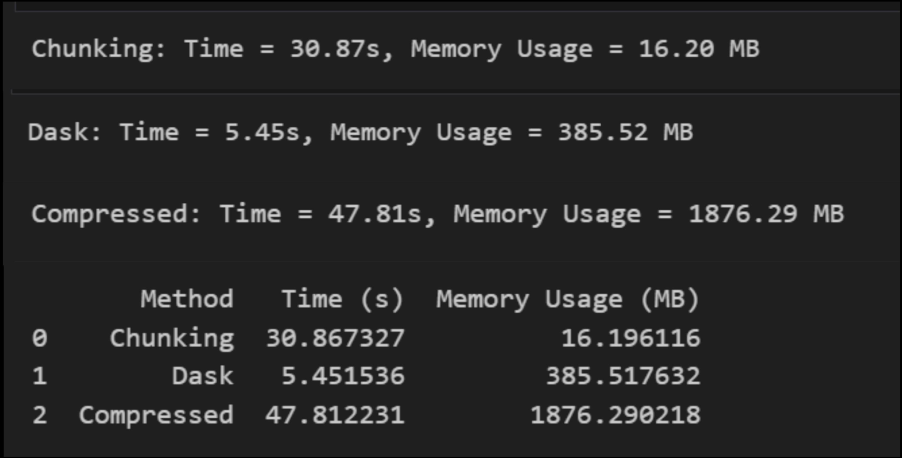

# Big Data Processing – Enron Email Dataset

This project demonstrates the performance comparison of three methods for reading and processing a large dataset using Python.

## 📄 Dataset

- **Name**: Enron Email Dataset
- **Format**: CSV
- **Size**: ~600MB+
- **Source**: [Kaggle](https://www.kaggle.com/datasets/wcukierski/enron-email-dataset)

The dataset contains email records exchanged between Enron employees prior to the company’s collapse.

---

## ⚙️ Methods Compared

Three data reading techniques were evaluated:

### 1. **Chunking**
- Uses `pandas.read_csv()` with `chunksize` to read the file in small parts.
- Very memory-efficient.
- Slower than Dask.

### 2. **Dask**
- Utilizes `dask.dataframe.read_csv()` for parallel, out-of-core computation.
- Faster performance.
- Higher memory usage.

### 3. **Compressed Reading**
- Reads a `.csv.gz` compressed version of the dataset using `compression='gzip'`.
- Slowest and most memory intensive.

---

## 📊 Results Summary

| Method      | Time (s) | Memory Usage (MB) |
|-------------|----------|--------------------|
| Chunking    | 30.87    | 16.20              |
| Dask        | 5.45     | 385.52             |
| Compressed  | 47.81    | 1876.29            |

---

## 🧠 Conclusion

- **Best Performance**: Dask (fastest read time)
- **Best Memory Efficiency**: Chunking
- **Worst Case**: Reading compressed files directly (highest memory usage and slowest)

---

## 💡 Recommendations

- Use **Chunking** for memory-constrained environments.
- Use **Dask** when speed is more critical and sufficient memory is available.
- Avoid reading compressed files directly for large-scale real-time tasks.

---

## 🛠 Requirements

- Python 3.8+
- pandas
- dask
- tracemalloc
- psutil

---

### The result Capture

