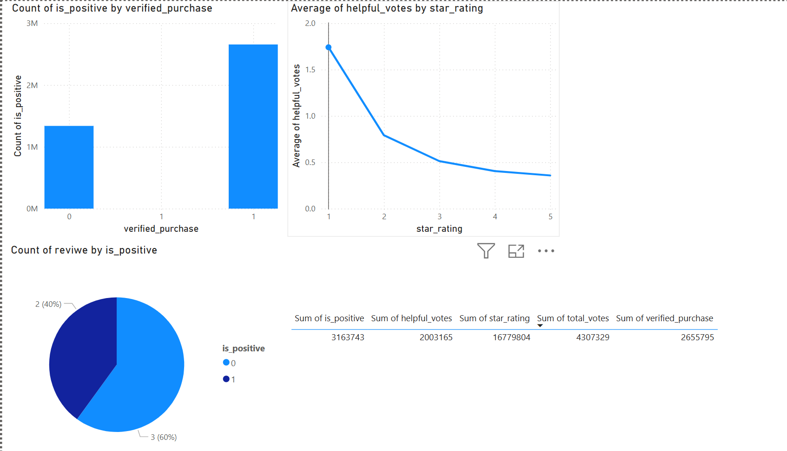
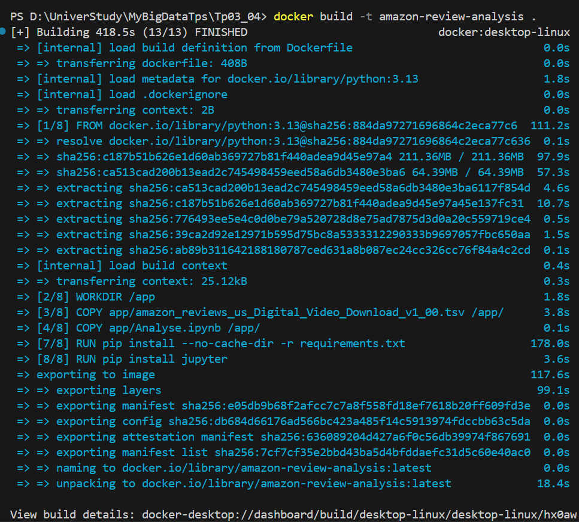
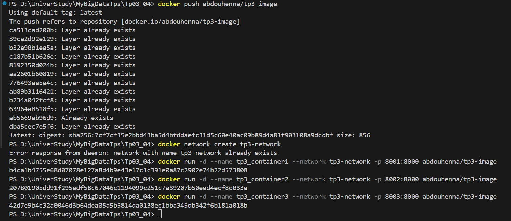
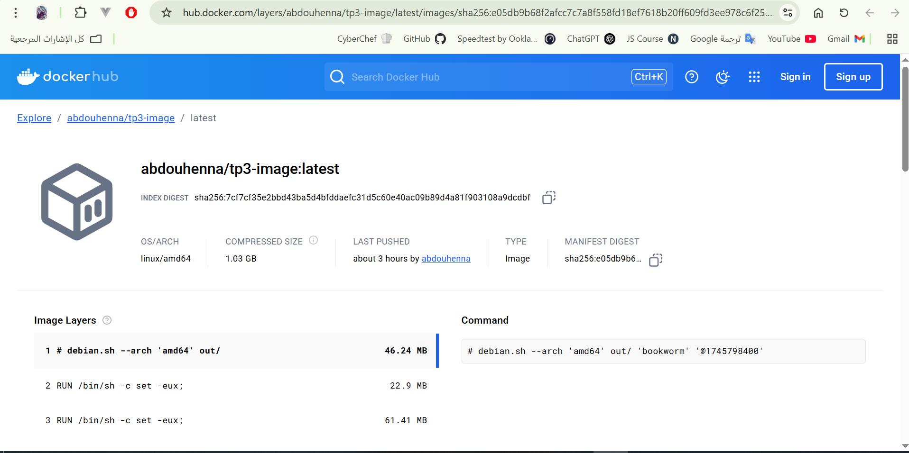
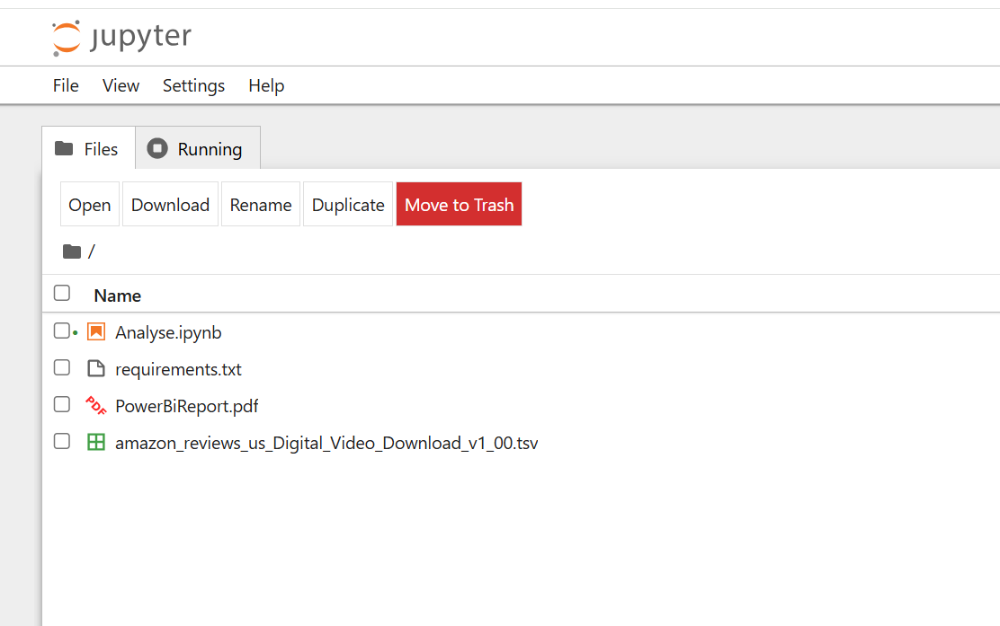
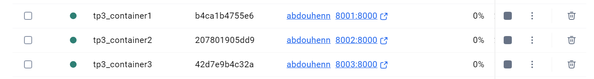

### 📊 Amazon Customer Reviews Analysis – Digital Video Category

#### 🗂 Dataset Overview
This project uses the **Amazon Customer Reviews (Digital Video Download)** dataset, which includes user reviews from the Amazon marketplace. The original dataset was in `.tsv` format, and we filtered and cleaned it to extract meaningful features for modeling and visualization.

- **Original File**: `amazon_reviews_us_Digital_Video_Download_v1_00.tsv`
- **Size**: ~600MB+
- **Cleaned File**: `clean_amazon_reviews.csv`
- **Features Used**:
  - `star_rating`
  - `helpful_votes`
  - `total_votes`
  - `verified_purchase`
  - `is_positive` *(generated target: 1 if rating ≥ 4, else 0)*

---

#### ⚙️ Modeling Summary

A `RandomForestClassifier` was used to predict whether a review is positive based on the available features.

- **Model**: Random Forest (n_estimators=200, max_depth=10)
- **Sample size used**: 10% of the dataset
- **Accuracy**: **0.823**

##### 🧪 Classification Report

| Class       | Precision | Recall | F1-Score | Support |
|-------------|-----------|--------|----------|---------|
| Not Positive (0) | 0.74      | 0.22   | 0.34     | 16543   |
| Positive (1)     | 0.83      | 0.98   | 0.90     | 63337   |

- The model performed well for positive reviews due to class imbalance.
- Further tuning or balancing (e.g. SMOTE, class weights) may improve results.

---


## 📈 Power BI Visualizations

Using the **available visual types in Power BI** (as shown in the provided screenshot), the following charts were created based on the cleaned dataset:

### 1. **Clustered Column Chart**
- **X-axis**: `verified_purchase`
- **Y-axis**: Count of `is_positive`
- **Purpose**: Compare the number of positive vs negative reviews for verified and non-verified purchases.

### 2. **Pie Chart**
- **Legend**: `is_positive`
- **Values**: Count of reviews
- **Purpose**: Show proportion of positive vs negative reviews.

### 4. **Line or Area Chart**
- **X-axis**: `star_rating`
- **Y-axis**: Average `helpful_votes`
- **Purpose**: Show the trend between rating and helpfulness of reviews.

### 5. **Table Visual**
- **Columns**: `star_rating`, `helpful_votes`, `total_votes`, `verified_purchase`, `is_positive`
- **Purpose**: Display detailed data in a structured format.

### The result Capture




---

#### ✅ Conclusion

This project demonstrated how to:

- Handle large `.tsv` files using `dask`
- Train a classifier on Amazon review data
- Generate performance metrics
- Visualize review behavior and verified purchase impact in Power BI

---

## 🐳 Running the Project with Docker

The project was containerized and successfully run using **Docker**, ensuring a reproducible environment for data cleaning and analysis.

### 📂 Files Included in Docker Image

- `amazon_reviews_us_Digital_Video_Download_v1_00.tsv`: Raw dataset.
- `Analyse.ipynb`: Jupyter Notebook used for data cleaning and model training.
- `PowerBiReport.pdf`: PDF export of Power BI visualizations.
- `requirements.txt`: Python dependencies for the notebook.

---

### ✅ Étapes Réalisées

1. **Création d’un compte Docker Hub**
   - Compte Docker créé sur [hub.docker.com](https://hub.docker.com)

2. **Création de l’image Docker**
   - Un `Dockerfile` a été préparé pour encapsuler le code de TP3 (analyse de données avec `pandas`, `dask`, etc.).
   - L’image a été construite avec la commande :
     ```bash
     docker build -t tp3-image .
     ```




3. **Connexion à Docker Hub**
   ```bash
   docker login
   ```

4. **Tag et Push de l’image**
   ```bash
   docker tag tp3-image <votre-username>/tp3-image
   docker push <votre-username>/tp3-image
   ```

5. **Pull de l’image Docker sur une autre machine**
   ```bash
   docker pull <votre-username>/tp3-image
   ```

---

### 🧱 Déploiement de plusieurs conteneurs

6. **Création d’un réseau Docker**
   ```bash
   docker network create tp3-network
   ```

7. **Lancement de trois conteneurs à partir de l’image**
   ```bash
   docker run -d --name tp3_container1 --network tp3-network -p 8001:8000 <votre-username>/tp3-image
   docker run -d --name tp3_container2 --network tp3-network -p 8002:8000 <votre-username>/tp3-image
   docker run -d --name tp3_container3 --network tp3-network -p 8003:8000 <votre-username>/tp3-image
   ```

8. **Vérification du bon fonctionnement des conteneurs**
   ```bash
   docker ps
   ```





---

### 📝 Remarques

- Les ports sont mappés pour accéder aux conteneurs individuellement.
- Le réseau `tp3-network` permet la communication entre conteneurs.
- L’image contient tous les packages nécessaires (`pandas`, `dask`, `sklearn`, etc.) grâce au `requirements.txt`.

---

### The result Capture









