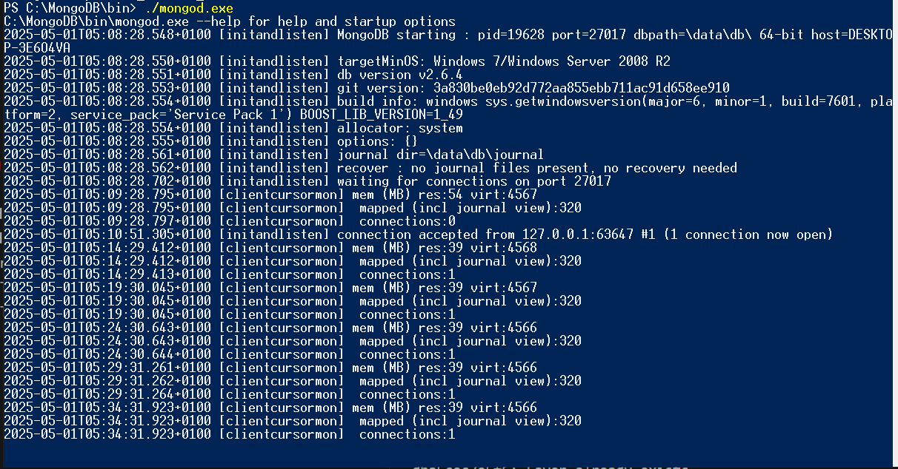
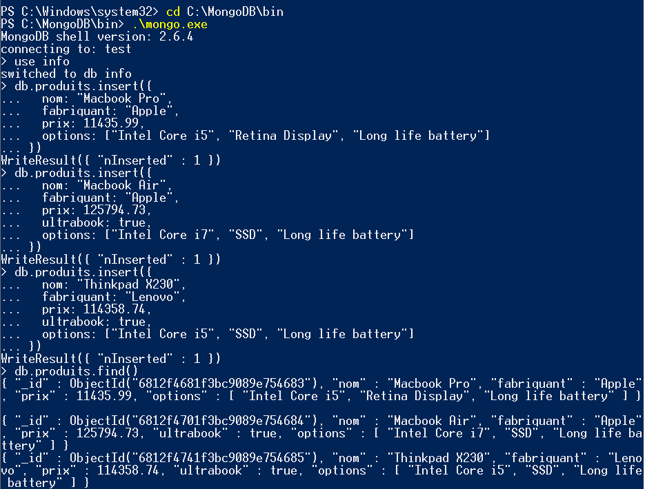
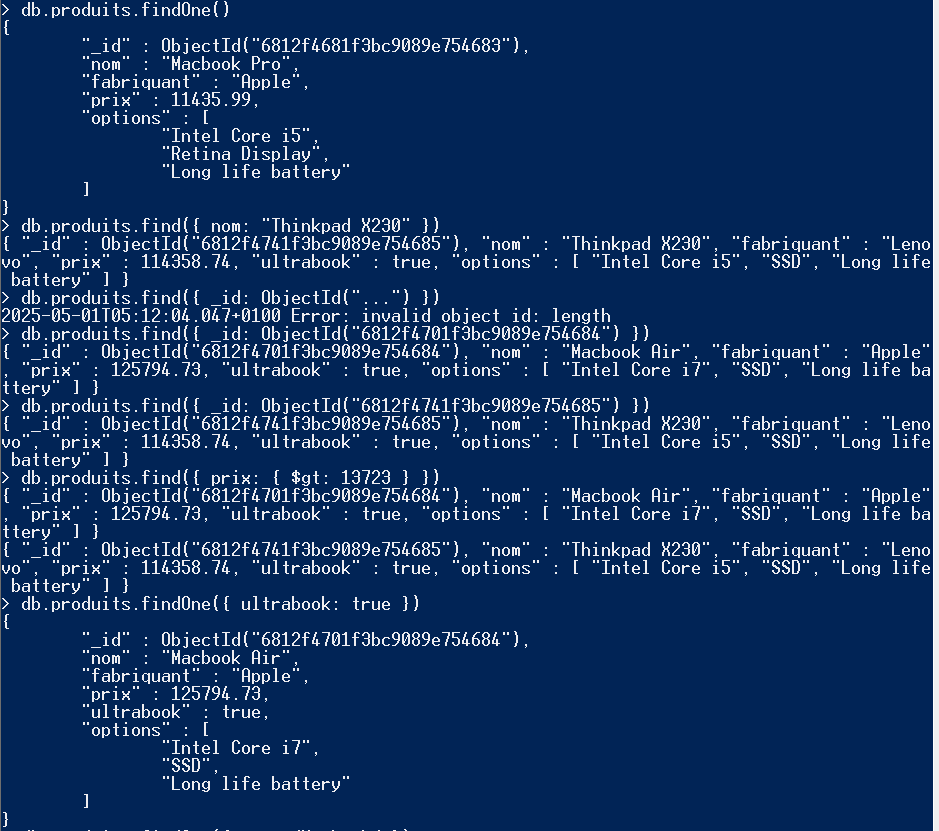
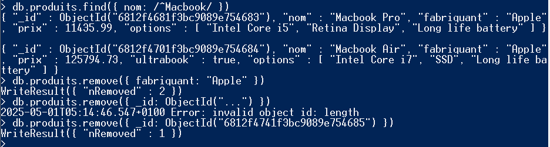

---

### MongoDB Server Started



# 🗂️ TP 05 - NoSQL Databases: MongoDB

## 📌 Objective

This practical assignment focuses on installing MongoDB on Windows, interacting with the MongoDB server through the shell, and performing basic CRUD operations on a `products` collection inside a NoSQL `info` database.

---

## ⚙️ Steps

### 1. MongoDB Installation on Windows

- Download MongoDB ZIP version from [Google Drive](https://drive.google.com/open?id=17J9ST0OcDfOGRd1OomtWDoiNDOp0yEvW)
- Extract contents to `C:\MongoDB`
- Create folders:  
  ```
  C:\data
  C:\data\db
  ```

---

### 2. Start MongoDB Server

```bash
cd C:\MongoDB\bin
mongod.exe
```

---

### 3. Launch MongoDB Client

Open a new CMD window:

```bash
cd C:\MongoDB\bin
mongo.exe
```

---

## 🧪 Operations Performed

### 4. Create Database and Collection

#### Select or create the database `info`:

```js
use info
```

#### Insert documents into `produits` collection:

```js
db.produits.insert({
  nom: "Macbook Pro",
  fabriquant: "Apple",
  prix: 11435.99,
  options: ["Intel Core i5", "Retina Display", "Long life battery"]
})

db.produits.insert({
  nom: "Macbook Air",
  fabriquant: "Apple",
  prix: 125794.73,
  ultrabook: true,
  options: ["Intel Core i7", "SSD", "Long life battery"]
})

db.produits.insert({
  nom: "Thinkpad X230",
  fabriquant: "Lenovo",
  prix: 114358.74,
  ultrabook: true,
  options: ["Intel Core i5", "SSD", "Long life battery"]
})
```

---

## 🔍 Data Exploration (Read Operations)

| Goal | Command |
|------|---------|
| Get all products | `db.produits.find()` |
| Get first product | `db.produits.findOne()` |
| Get product by ID | `db.produits.find({ _id: ObjectId("...") })` |
| Products with price > 13723 | `db.produits.find({ prix: { $gt: 13723 } })` |
| First ultrabook = true | `db.produits.findOne({ ultrabook: true })` |
| Product name contains "Macbook" | `db.produits.findOne({ nom: /Macbook/ })` |
| Name starts with "Macbook" | `db.produits.find({ nom: /^Macbook/ })` |

---

## 🧹 Delete Operations

| Task | Command |
|------|---------|
| Delete products where `fabriquant = "Apple"` | `db.produits.remove({ fabriquant: "Apple" })` |
| Delete Thinkpad X230 by ID | `db.produits.remove({ _id: ObjectId("...") })` |

---

## ✅ Status

All requirements of the TP have been implemented:
- MongoDB installed and configured on Windows
- Server and client launched correctly
- Collection and documents created
- CRUD operations performed successfully

---

### The result Capture







