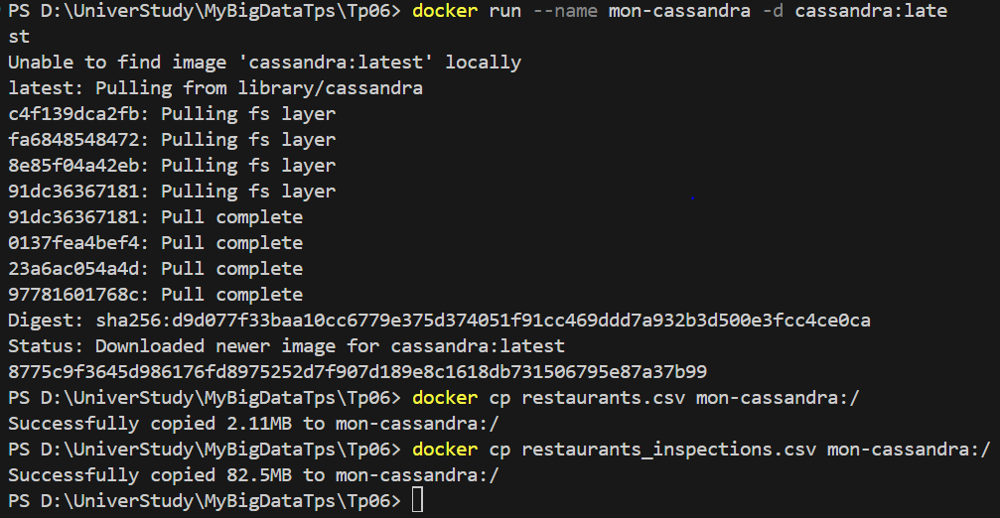
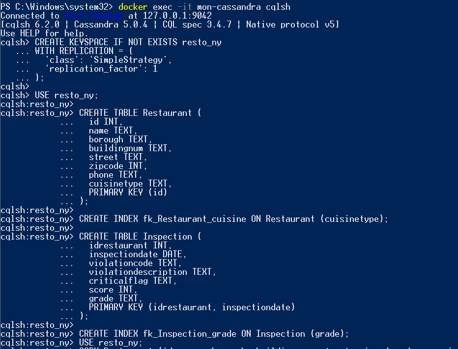
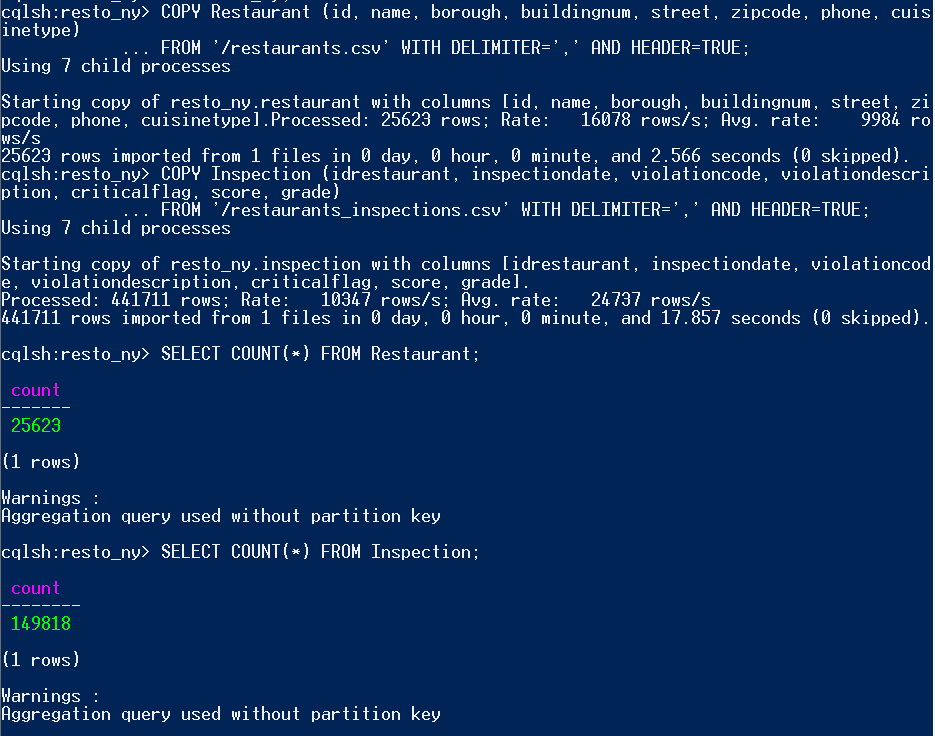
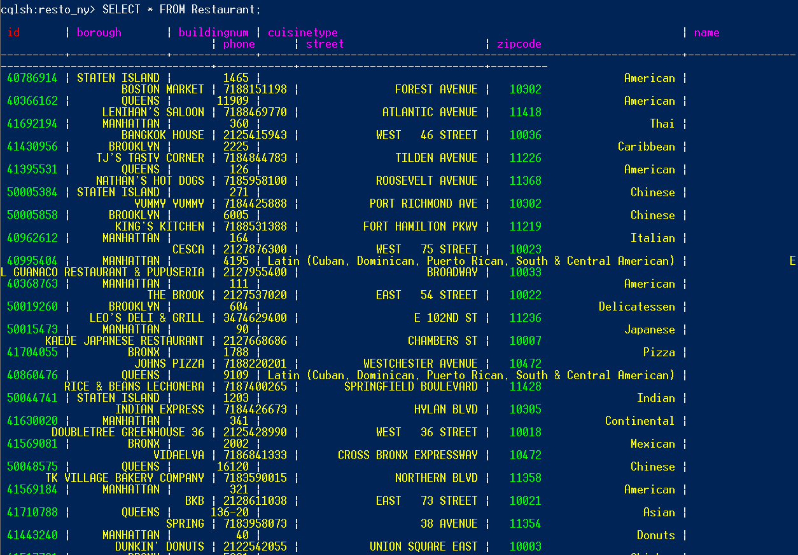
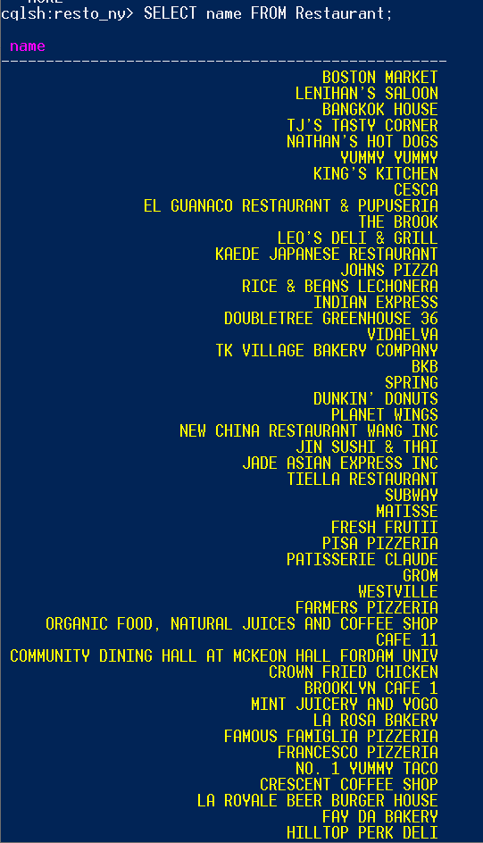
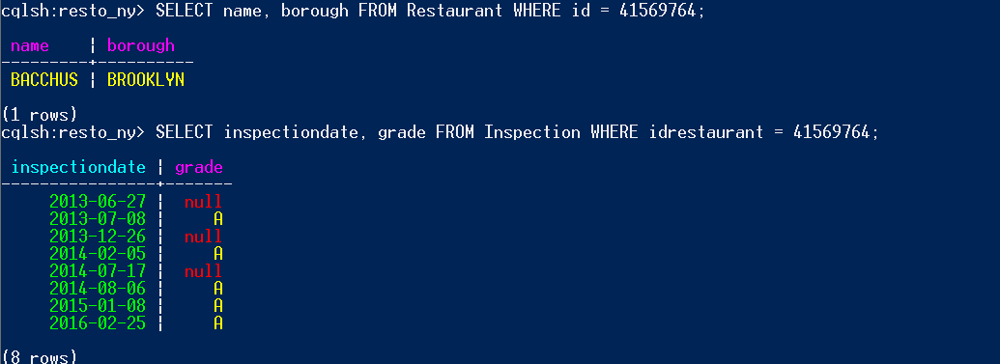
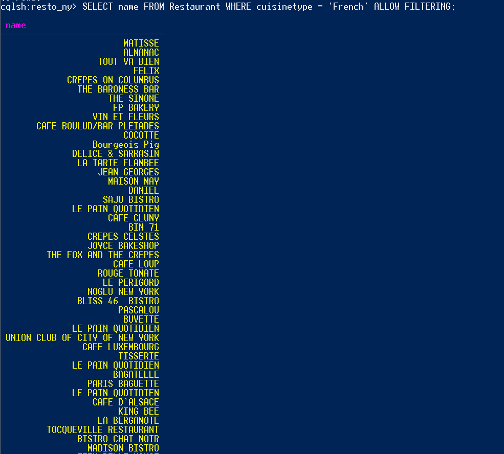
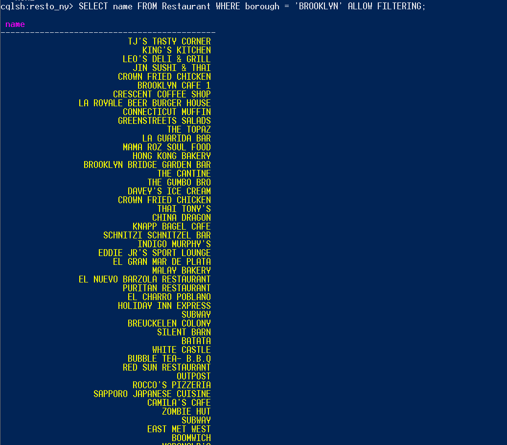
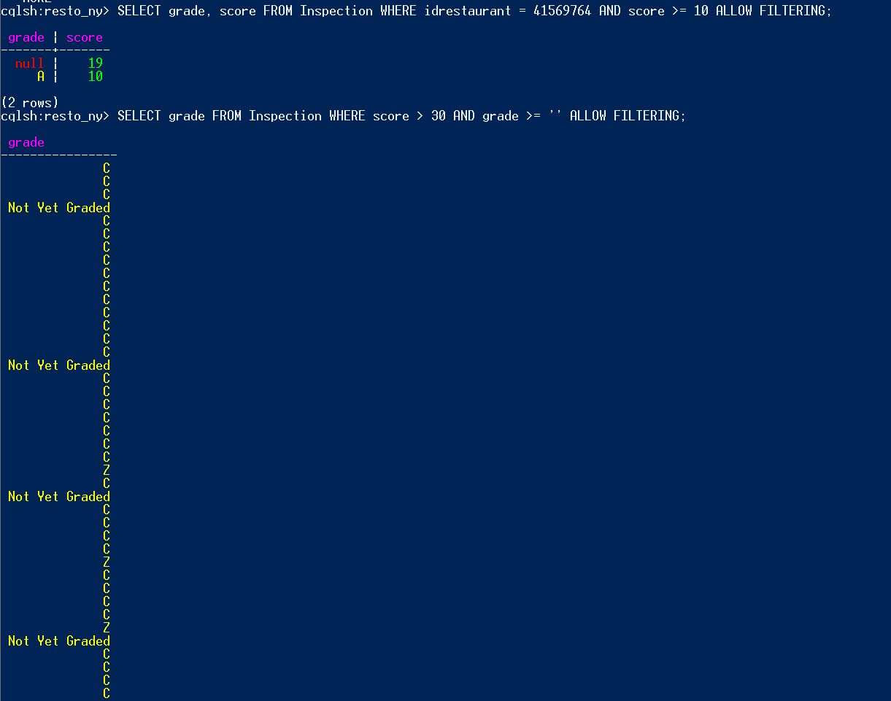
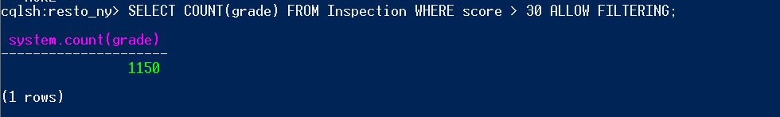

# TP N° 6: NoSQL Databases - Apache Cassandra

This project demonstrates the use of Apache Cassandra to manage a restaurant inspection dataset using CQL (Cassandra Query Language). The work was conducted in a Dockerized environment and includes database creation, table definitions, data importation, and query operations.

---

## Step 1: Install Cassandra and Upload CSV Files

Docker container was launched with the official Cassandra image. Dataset files (`restaurants.csv` and `restaurants_inspections.csv`) were copied into the container.

**Image:**


---

## Step 2: Keyspace and Table Creation

```sql
CREATE KEYSPACE IF NOT EXISTS resto_ny
WITH REPLICATION = { 'class': 'SimpleStrategy', 'replication_factor': 1 };

USE resto_ny;

CREATE TABLE Restaurant (
  id INT,
  name TEXT,
  borough TEXT,
  buildingnum TEXT,
  street TEXT,
  zipcode INT,
  phone TEXT,
  cuisinetype TEXT,
  PRIMARY KEY (id)
);

CREATE INDEX fk_Restaurant_cuisine ON Restaurant (cuisinetype);

CREATE TABLE Inspection (
  idrestaurant INT,
  inspectiondate DATE,
  violationcode TEXT,
  violationdescription TEXT,
  criticalflag TEXT,
  score INT,
  grade TEXT,
  PRIMARY KEY (idrestaurant, inspectiondate)
);

CREATE INDEX fk_Inspection_grade ON Inspection (grade);
```

---

## Step 3: Import CSV Data into Cassandra

```bash
docker cp restaurants.csv mon-cassandra:/
docker cp restaurants_inspections.csv mon-cassandra:/
```

```sql
USE resto_ny;

COPY Restaurant (id, name, borough, buildingnum, street, zipcode, phone, cuisinetype)
FROM '/restaurants.csv' WITH DELIMITER=',' AND HEADER=TRUE;

COPY Inspection (idrestaurant, inspectiondate, violationcode, violationdescription, criticalflag, score, grade)
FROM '/restaurants_inspections.csv' WITH DELIMITER=',' AND HEADER=TRUE;
```

---

## Step 4: Queries in CQL

Here are the queries executed to explore and filter the dataset using `cqlsh`.

### 1. List all restaurants
```sql
SELECT * FROM Restaurant;
```

### 2. List only restaurant names
```sql
SELECT name FROM Restaurant;
```

### 3. Name and borough of restaurant with ID 41569764
```sql
SELECT name, borough FROM Restaurant WHERE id = 41569764;
```

### 4. Inspection dates and grades for that restaurant
```sql
SELECT inspectiondate, grade FROM Inspection WHERE idrestaurant = 41569764;
```

### 5. French cuisine restaurants
```sql
SELECT name FROM Restaurant WHERE cuisinetype = 'French' ALLOW FILTERING;
```

### 6. Restaurants in BROOKLYN
```sql
SELECT name FROM Restaurant WHERE borough = 'BROOKLYN' ALLOW FILTERING;
```

### 7. Grades and scores for restaurant 41569764 with score >= 10
```sql
SELECT grade, score FROM Inspection WHERE idrestaurant = 41569764 AND score >= 10 ALLOW FILTERING;
```

### 8. Non-null grades with score > 30
```sql
SELECT grade FROM Inspection WHERE score > 30 AND grade >= '' ALLOW FILTERING;
```

### 9. Count those grades
```sql
SELECT COUNT(grade) FROM Inspection WHERE score > 30 ALLOW FILTERING;
```

---

## Step 5: Command Execution Screenshots

Here are the screenshots for each command execution:

- 
- 
- 
- 
- 
- 
- 
- 
- 

---

## Summary
This TP demonstrates how Cassandra can efficiently manage large-scale data such as restaurant inspections. Although CQL is similar to SQL, it introduces restrictions and requires the use of ALLOW FILTERING or indexes for certain types of queries. The work was successfully completed in a Docker containerized environment.

