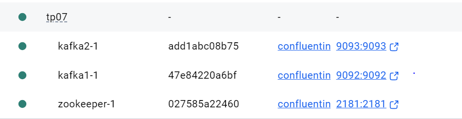
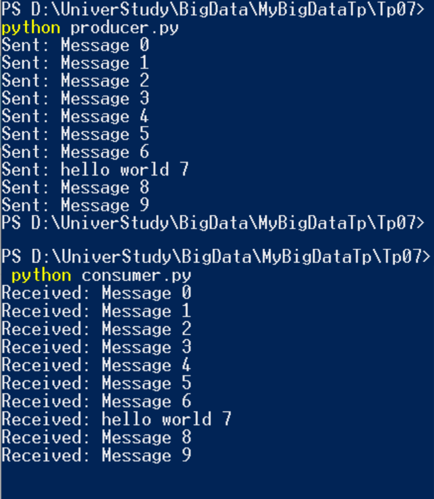
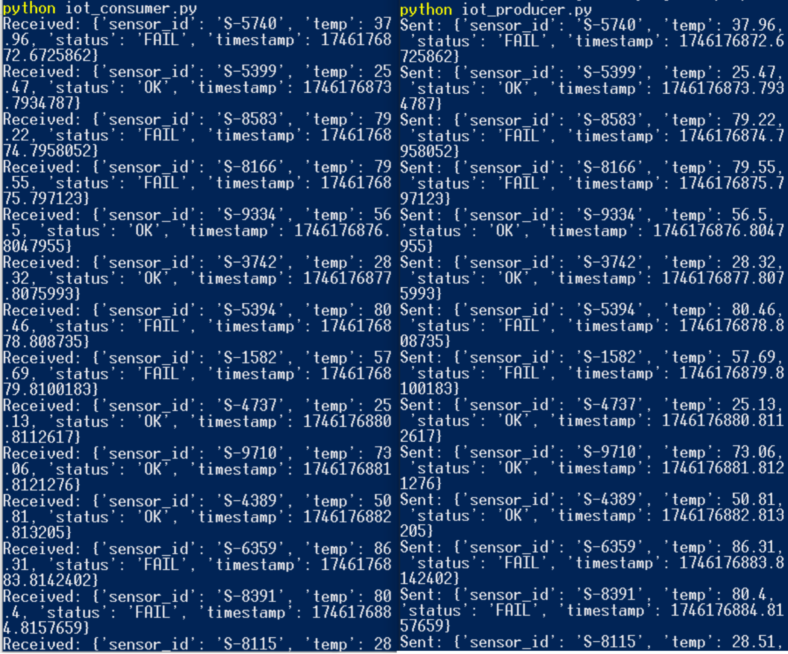

# TP N°7: Apache Kafka - Data Streaming with IoT Simulation

This project demonstrates the use of Apache Kafka for real-time data streaming. The TP is divided into several parts, including basic Kafka setup, topic creation, a producer-consumer example, multi-broker configuration, and an IoT-based project simulation.

---

## 🧩 Objective
To simulate a real-world IoT system where sensors stream data to Kafka topics. The project is designed to explore Kafka's capabilities for real-time data pipelines.

---

## 📦 Steps Overview

### 1. Kafka Installation (Windows via Docker)
- Docker and Docker Compose were used to run Kafka and Zookeeper.
- Kafka cluster composed of multiple containers simulating brokers.

**Screenshot:**
- 

### 2. Creating a Kafka Topic
- A replicated Kafka topic named `replicated-topic` was created using the Kafka CLI inside the broker container.

### 3. Producer-Consumer Example
- A basic producer (`producer.py`) was used to send a sequence of plain text messages to the Kafka topic.
- This demonstrates a typical Kafka message flow in a publish-subscribe system.

**Result Preview:**

- 

### 4. Configuring Multiple Brokers
- The cluster was configured to include more than one broker.
- Replication factor was set to 2 to ensure fault tolerance.
- Configuration tested by creating a topic with replication.

### 5. IoT + Kafka Project
- An advanced producer (`iot_producer.py`) simulated IoT sensor data.
- Each message contained JSON-formatted data: sensor ID, temperature, status (OK/FAIL), and timestamp.
- Messages were published to the `iot-data` topic in real-time.

**IoT Result Preview:**

- 

---

## 🔍 Summary
| Task                          | Status |
|-------------------------------|--------|
| Kafka installed via Docker    | ✅     |
| Topic created successfully    | ✅     |
| Producer sends data to topic | ✅     |
| IoT simulation integrated     | ✅     |
| Multi-broker cluster tested   | ✅     |

This TP illustrates Kafka's core features including high-throughput data streaming, scalability with brokers, and integration with external data sources like IoT.

---

> This practical work is a foundational exercise in integrating Kafka with real-time applications such as machine monitoring systems using IoT.

