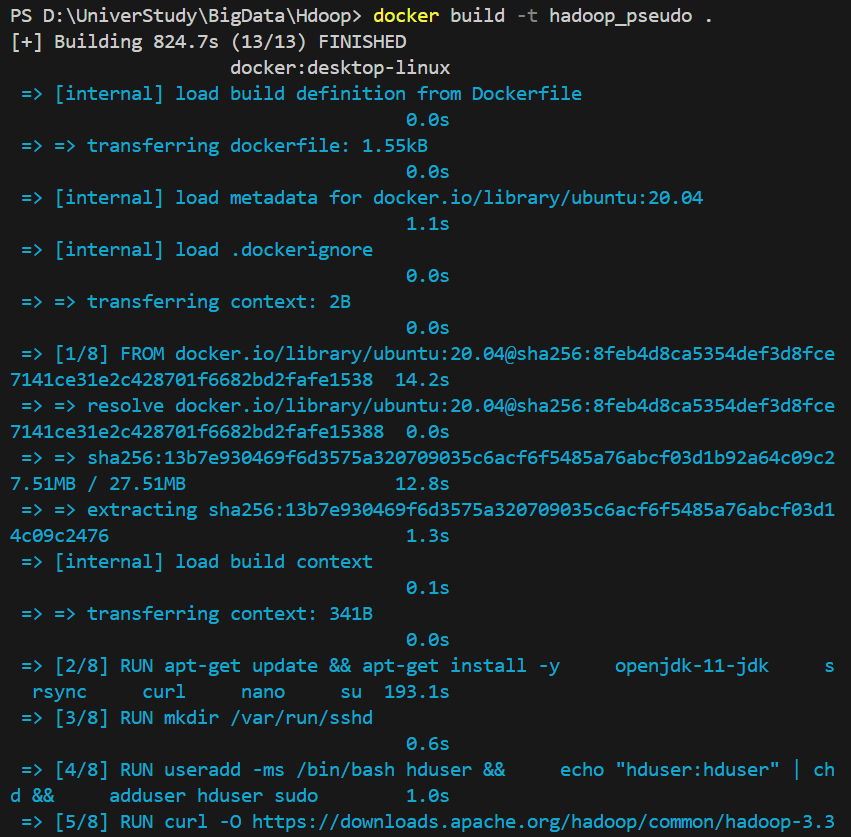
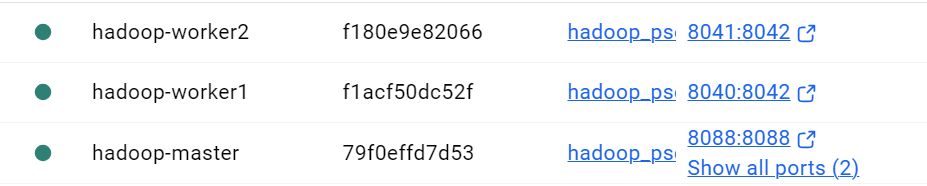
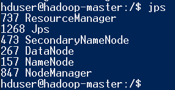
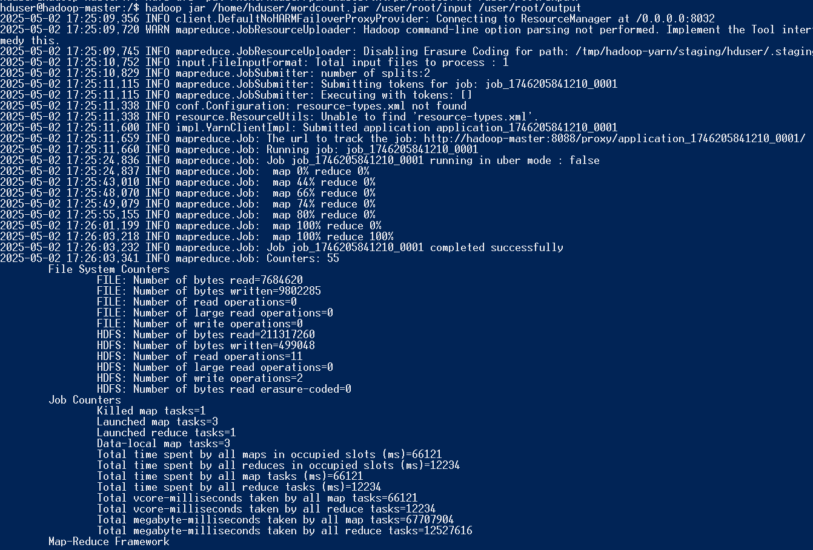
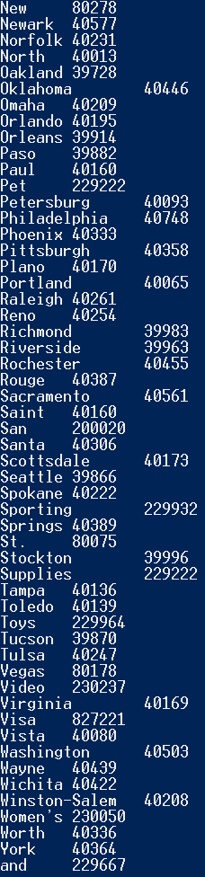

# TP N° 8: Big Data - Apache Hadoop MapReduce

This project demonstrates the use of Apache Hadoop in a pseudo-distributed Docker environment to process a simple dataset using a custom WordCount MapReduce program. The work involves creating a 3-node Hadoop cluster (1 master and 2 workers), configuring HDFS and YARN, uploading a text dataset, compiling a Java MapReduce program, and executing it to count word frequencies.

---

## Step 1: Build Docker Image for Hadoop Environment

We started by building a custom Docker image named `hadoop_pseudo` based on Ubuntu 20.04, with Java 11, SSH, and Hadoop 3.3.6 installed and configured.

```bash
docker build -t hadoop_pseudo .
```

**Image:**


---

## Step 2: Create Docker Network and Cluster Containers

We created a custom Docker network and launched three containers:

* `hadoop-master` (Namenode + ResourceManager)
* `hadoop-worker1` (Datanode + NodeManager)
* `hadoop-worker2` (Datanode + NodeManager)

```bash
docker network create hadoop

docker run -itd --net=hadoop -p 9870:9870 -p 8088:8088 --name hadoop-master --hostname hadoop-master hadoop_pseudo
docker run -itd -p 8040:8042 --net=hadoop --name hadoop-worker1 --hostname hadoop-worker1 hadoop_pseudo
docker run -itd -p 8041:8042 --net=hadoop --name hadoop-worker2 --hostname hadoop-worker2 hadoop_pseudo
```

**Image:**


---

## Step 3: Configure and Start Hadoop

We configured the following Hadoop XML files inside the master container:

* `core-site.xml`
* `hdfs-site.xml`
* `mapred-site.xml`
* `yarn-site.xml`
* `hadoop-env.sh`

Then we formatted the namenode and started HDFS and YARN:

```bash
hdfs namenode -format
start-dfs.sh
start-yarn.sh
```

**Image:**


---

## Step 4: Upload Input File to HDFS

We prepared a local text file named `purchases.txt` containing sample data. Then we uploaded it to HDFS:

```bash
hdfs dfs -mkdir -p /user/root/input
hdfs dfs -put purchases.txt /user/root/input/
```


---

## Step 5: Create WordCount MapReduce Program (Java + Maven)

On the Windows host system, we created a Java Maven project with 3 main classes:

* `WordCount.java`
* `TokenizerMapper.java`
* `IntSumReducer.java`

The project was compiled using:

```bash
mvn clean package
```


---

## Step 6: Copy JAR to Hadoop Master and Execute Job

We copied the generated JAR to the master container:

```bash
docker cp target/wordcount-1.0-SNAPSHOT-jar-with-dependencies.jar hadoop-master:/home/hduser/wordcount.jar
```

Then, from inside the master container:

```bash
hadoop jar /home/hduser/wordcount.jar /user/root/input /user/root/output
```

**Image:**


---

## Step 7: View Output from HDFS

After execution, we verified the output result using:

```bash
hdfs dfs -cat /user/root/output/part-r-00000
```

**Image:**



---

## The Result With OurPurchases.txt


**Image:**


---

## Summary

This TP demonstrated the process of setting up a pseudo-distributed Hadoop environment with Docker, configuring core services (HDFS and YARN), writing and executing a MapReduce program, and processing a real input dataset. The successful execution of WordCount validated our cluster and development setup.

---

