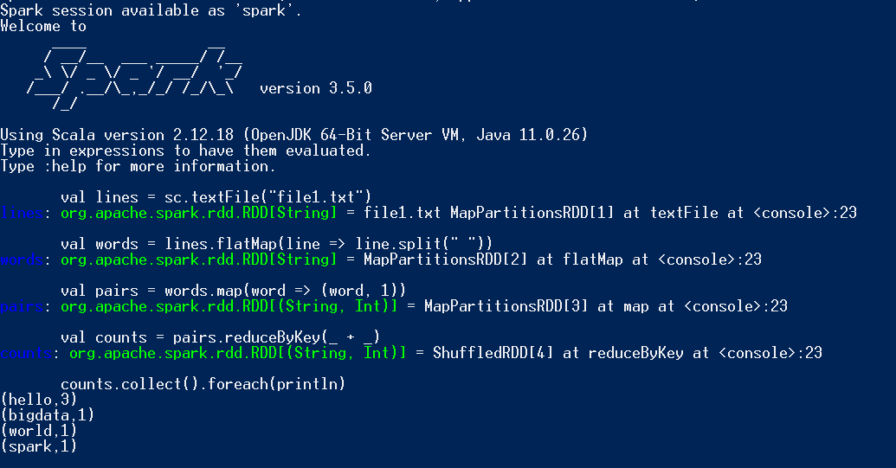
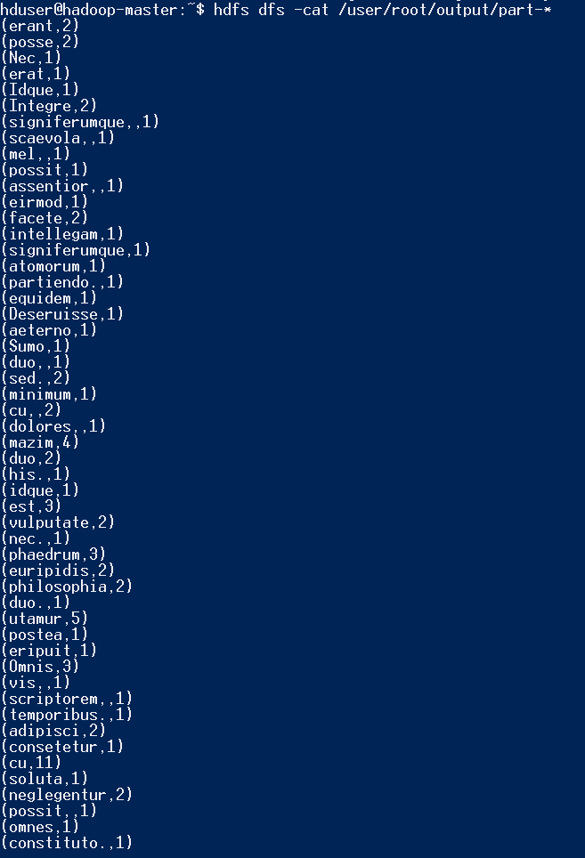
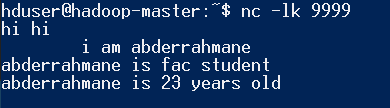
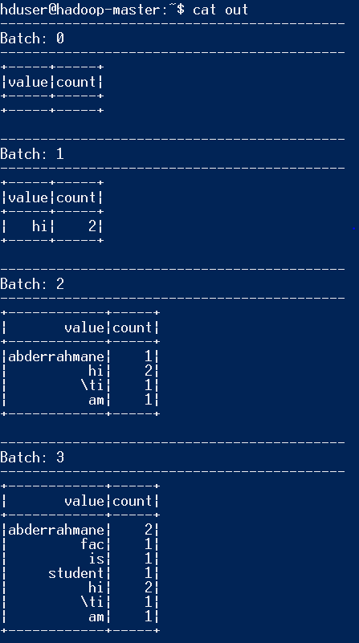

# TP N°9: Big Data - Apache Spark on Hadoop YARN

This project extends the previous MapReduce TP by integrating **Apache Spark** into our existing Hadoop pseudo-distributed cluster (built with Docker). It demonstrates installing Spark, verifying it works in YARN mode, and running a basic **WordCount Spark job** using `spark-submit`, while leveraging HDFS as input/output data storage.

---

## Step 1: Reuse Existing Docker Hadoop Cluster

We reused the Docker image and 3-container Hadoop cluster created in [TP N°8](../TP8/README.md), which includes:

- A custom image: `hadoop_pseudo`
- Containers:
  * `hadoop-master` (Namenode + ResourceManager)
  * `hadoop-worker1` (Datanode + NodeManager)
  * `hadoop-worker2` (Datanode + NodeManager)

**Image:**  


---

## Step 2: Install Apache Spark on All Nodes

We installed **Apache Spark 3.5.0** manually inside each container (master and workers). Steps (inside each container):

```bash
cd /opt
wget https://downloads.apache.org/spark/spark-3.5.0/spark-3.5.0-bin-hadoop3.tgz
tar -xvzf spark-3.5.0-bin-hadoop3.tgz
ln -s spark-3.5.0-bin-hadoop3 spark
````

Then we updated `.bashrc`:

```bash
export SPARK_HOME=/opt/spark
export PATH=$PATH:$SPARK_HOME/bin:$SPARK_HOME/sbin
```

Reload with:

```bash
source ~/.bashrc
```


---

## Step 3: Test Spark with YARN (First Test)

We launched a basic Spark shell test using YARN as the cluster manager:

```bash
spark-shell --master yarn
```

If everything is correctly configured, the shell opens and prints the Spark version and YARN resource messages.

**Image:**



---

## Step 4: Create Spark WordCount Java Program

We created a **Java Spark project** using Maven with the following dependency added to `pom.xml`:

```xml
<dependency>
  <groupId>org.apache.spark</groupId>
  <artifactId>spark-core_2.12</artifactId>
  <version>3.5.0</version>
</dependency>
```

The main class `App.java` performs WordCount on a text file stored in HDFS:

```java
import org.apache.spark.SparkConf;
import org.apache.spark.api.java.JavaPairRDD;
import org.apache.spark.api.java.JavaRDD;
import org.apache.spark.api.java.JavaSparkContext;
import scala.Tuple2;

import java.util.Arrays;

public class App {
    public static void main(String[] args) {
        if (args.length < 2) {
            System.err.println("Please provide input and output paths.");
            System.exit(1);
        }
        new App().run(args[0], args[1]);
    }

    public void run(String inputFilePath, String outputDir) {
        SparkConf conf = new SparkConf()
                .setAppName(App.class.getName()); 

        JavaSparkContext sc = new JavaSparkContext(conf);

        JavaRDD<String> textFile = sc.textFile(inputFilePath);

        JavaPairRDD<String, Integer> counts = textFile
                .flatMap(line -> Arrays.asList(line.trim().split("\\s+")).iterator()) 
                .mapToPair(word -> new Tuple2<>(word, 1))
                .reduceByKey(Integer::sum);

        counts.saveAsTextFile(outputDir);

        sc.close();
    }
}

```

We packaged the project using:

```bash
mvn clean package
```

---

## Step 5: Copy JAR File and Prepare Input in HDFS

We copied the generated JAR to the master node:

```bash
docker cp target/spark-wordcount-1.0-SNAPSHOT.jar hadoop-master:/home/hduser/spark-wordcount.jar
```

Inside `hadoop-master`, we created and uploaded the input text file:

```bash
nano purchases.txt  # Add sample text

hdfs dfs -rm -r /user/root/input
hdfs dfs -mkdir -p /user/root/input
hdfs dfs -put /home/hduser/purchases.txt /user/root/input/
```


---

## Step 6: Execute Spark WordCount with YARN

We ran the job on the Hadoop cluster using:

```bash
hdfs dfs -rm -r /user/root/output

spark-submit \
  --class App \
  --master yarn \
  /home/hduser/spark-wordcount.jar \
  /user/root/input/purchases.txt \
  /user/root/output
```

**Image:**


---

## Step 7: View Output from HDFS

After successful execution, we displayed the results from HDFS:

```bash
hdfs dfs -cat /user/root/output/part-*
```

Sample output:

```
(mel,,1)
(duo,2)
(utamur,5)
(mazim,4)
...
```

**Image:**




### Result Of OurPurchases.txt From Tp08


---


## Step 8: Spark Streaming Integration

To simulate streaming, we extended our Spark project to include a **Spark Streaming job** using a local text socket as the input source. This allows Spark to process real-time text input from a server on port 9999.

### Project Setup

We added the following Maven dependency for Spark Streaming in `pom.xml`:

```xml
<dependency>
  <groupId>org.apache.spark</groupId>
  <artifactId>spark-streaming_2.12</artifactId>
  <version>3.5.0</version>
</dependency>
```

### Main Streaming Class

We created a new Java class `Stream.java` under package `spark.streaming.tp22` that counts words in real-time from a socket stream:

```java
package spark.streaming.tp22;

import org.apache.spark.SparkConf;
import org.apache.spark.api.java.function.FlatMapFunction;
import org.apache.spark.api.java.function.Function2;
import org.apache.spark.api.java.function.PairFunction;
import org.apache.spark.streaming.Durations;
import org.apache.spark.streaming.api.java.JavaDStream;
import org.apache.spark.streaming.api.java.JavaPairDStream;
import org.apache.spark.streaming.api.java.JavaReceiverInputDStream;
import org.apache.spark.streaming.api.java.JavaStreamingContext;
import scala.Tuple2;

import java.util.Arrays;

public class Stream {
    public static void main(String[] args) throws Exception {
        SparkConf conf = new SparkConf().setAppName("SparkStreamingApp").setMaster("local[*]");
        JavaStreamingContext jssc = new JavaStreamingContext(conf, Durations.seconds(5));

        JavaReceiverInputDStream<String> lines = jssc.socketTextStream("localhost", 9999);
        JavaDStream<String> words = lines.flatMap((FlatMapFunction<String, String>) line -> Arrays.asList(line.split(" ")).iterator());
        JavaPairDStream<String, Integer> wordCounts = words
                .mapToPair((PairFunction<String, String, Integer>) word -> new Tuple2<>(word, 1))
                .reduceByKey((Function2<Integer, Integer, Integer>) Integer::sum);

        wordCounts.print();
        jssc.start();
        jssc.awaitTermination();
    }
}
```

### Run Instructions

1. Compile and package the JAR:

```bash
mvn clean package
```

2. Copy the JAR to `hadoop-master`:

```bash
docker cp target/stream-1.jar hadoop-master:/home/hduser/
```

3. Start a simple socket text stream server inside the master node (in a new terminal):

```bash
docker exec -it hadoop-master bash
nc -lk 9999
```

4. From another terminal, run the Spark Streaming job:

```bash
docker exec -it hadoop-master bash
spark-submit --class spark.streaming.tp22.Stream --master local /home/hduser/stream-1.jar
```

### Sample Output

When typing words into the Netcat server (one line at a time), the terminal running `spark-submit` prints aggregated word counts every 5 seconds:

**Image:**






---


## Summary

This TP successfully integrates **both batch and streaming processing** using Apache Spark on our Hadoop YARN Docker cluster. We:

* Installed and configured Spark across all nodes.
* Executed a distributed WordCount job on HDFS using YARN.
* Implemented a real-time word count streaming application via Spark Streaming and Netcat.

This confirms our cluster can support both **batch and real-time data processing** with Spark.

